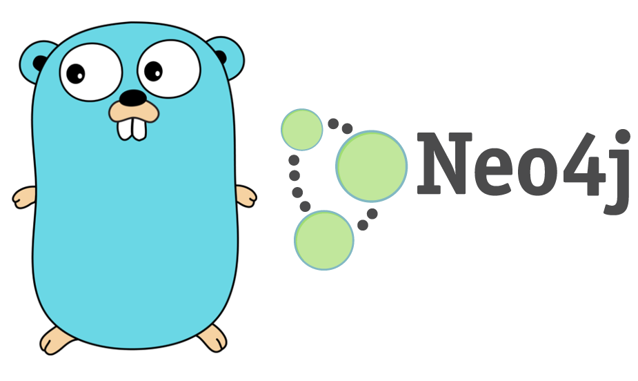
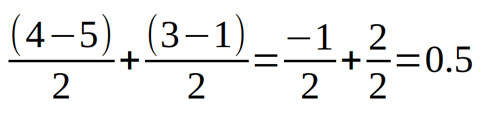
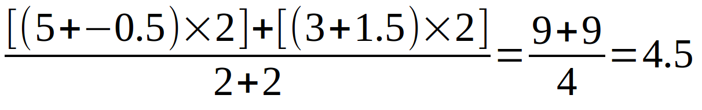

class: center, middle, inverse, large

# Recipes for Recommendations
## (with Neo4j)

???

- Usual spiel about being Australian
- Happy for this to be fairly interactive.

---

background-image: url("./images/me.jpg")

???

- Software developer since ~2002
- This is our rescue dog Sukie
- Anyone have a rescue dog?

---

class: center, middle, inverse, large

# What is a recommendation engine?

???

- A recommendation engine filters items by predicting how a user might rate them.

- Connecting your existing users with the items in your massive inventory.

---

background-image: url("./images/amazon.png")

???

- Classic example is Amazon

---

background-image: url("./images/pandora.png")

???

- Pandora's music stations are also a recommendation

---

class: center, middle, inverse, large

# What is the problem?

???

- Recommendation engine etc - HARD problem (where do I start?)
- Feels Impenetrable

---

background-image: url("./images/equations.png")

???

If you don't have a math background, this is very intimidating.

---

background-image: url("./images/chocolate-cake.jpg")

???

- I see the cake, and I've no idea where to start

---

# (My Mother's) One Bowl Chocolate Cake

.left-column[
### Ingredients
- 2 cups of self raising flower
- 2 cups of castor sugar
- 4 tablespoons of cocao
- 4 ounces of melted butter
- 1 cup of milk
- 4 eggs
]

.right-column[
### Process
1. Heat oven to 356F.
1. Line a large spring form tin with baking paper.
1. Mix all ingredients together.
1. Bake for 30-40 minutes, until a skewer comes out clean.
]

???

- Suddenly this doesn't seem so hard

---

# Getting Our Recipes

- Hypothetical case study
- Look at two recommendations
- Realise recommendations aren't that scary

???

- I'm not a machine learning expert / data scientist
- stopped doing formal math training in high school

---

class: center, middle, inverse, large

# Case Study: Adopt A Dog
<a href="http://localhost/?r=none" target="_blank">open</a>

???

- Dog Rescue++

---
name: ingredients

# Ingredients (Technical Stack)

.center[

]


???

- Go
- Neo4j
- Tech stack doesn't really matter.
- We won't see the Go code. Check Github
- Neo4j is a graph db
- Has great visualisation tools
- Makes you think about your data's relationships (as a graph).
- Very easy to traverse the relationships (or edges) in the graph.

---

class: center, middle, inverse, large

# Explicit <br/>vs<br/>Implicit Ratings

???

- Final ingredient: Ratings
- What is a good thing?
- Explicit rating: Stars, thumb up, like
- Implicit: Page views, orders etc.
- I could get people to click on pictures of dogs
- Sent family and friends to the site

---

background-image: url("./images/pageView-graph.png")

???

<!---
MATCH (s:MuxSession)
WITH s
LIMIT 5
MATCH (d:Dog)<-[:WITH_DOG]-(p:PageView)<-[:HAS_VIEWED]-(s)
RETURN d, p, s
LIMIT 50
-->

- Special Ingredient: Graph of Data
- Session->PageView->Dog
- See some relationships forming

---

class: center, middle, inverse, large

# People Who Looked At This Dog Also Looked At...

???

- First recipe
- Can see this in the graph.
- May also know this as "People who bought this product also bought"

---

# Recipe: Looked At This Dog Also Looked At...

.left-column[
### Ingredients
- Sessions
- Page Views
- Dogs
]

.right-column[
### Process
1. Get the Dog currently being looked at
1. Get all Sessions that have Page Views for this Dog
1. Get all the other Dogs that the Sessions have also looked at
1. Count the number of Page Views the other Dogs have
1. Sort the Dog results by the number of Page Views descending
]

---

background-image: url("./images/pageView-graph.png")

???

Zeus is a good example

1. Get the Dog currently being looked at
1. Get all Sessions that have Page Views for this Dog
1. Get all the other Dogs that the Sessions have also looked at
1. Count the number of Page Views the other Dogs have
1. Sort the Dog results by the number of Page Views descending

---

# Recipe as Cypher Query

```cypher
MATCH (origin:Dog)<-[:WITH_DOG]-(:PageView)
      <-[:HAS_VIEWED]-(session:MuxSession)-[:HAS_VIEWED]->
      (view:PageView)-[:WITH_DOG]->(recommendation:Dog)
WHERE
    ID(origin) = {id}
    AND recommendation <> origin
    AND recommendation.adopted = false
    AND session.ident <> {ident}
RETURN COUNT(DISTINCT view) as total, recommendation
ORDER BY total DESC
```

???

1. Get the Dog currently being looked at
1. Get all Sessions that have Page Views for this Dog
1. Get all the other Dogs that the Sessions have also looked at
1. Count the number of Page Views the other Dogs have
1. Sort the Dog results by the number of Page Views descending

---

class: center, middle, inverse, large

# People Who Looked At This Dog Also Looked At...
<a href="http://localhost/?r=looked" target="_blank">open</a>

???

- Super simple
- Can be weighted to give different results
- e.g. Age / Dog Size.

---

class: center, middle, inverse, large

# Some dogs we thought you might like...

???

- Second recommendation
- Recommendations just for you
- This one is a bit more involved

---

class: center, middle, inverse, large

# Collaborative Filtering<br/>vs<br/>Categorisation

???

- Collaborative filtering: use ratings to make recommendations based on users behavior (social graph)
- Categorisation: Requires deep knowledge of the inventory of products. Each item must be profiled/rated.
- Categorisation => Content based approach
---

class: center, middle, inverse, large

# User to User<br/>vs</br>Item to Item<br/>Collaborative Filtering

???

- Could do user to user , but as sessions grow, this can be hard to scale.
- Item to item tends to scale better, and has several quite easy to implement algos.

---

# Predicting Session's Page Views

|   | Belle | Gus |
|---|---|---|
| Session A | 4 | 5 |
| Session B | 5 | .red[?] |

???

- We don't look for Sessions with similar scores, and see what that person likes.
- We attempt to predict what the Sessions's Page Views for a given Dog would be instead.
- DO NOT MENTION WHAT WE THINK GUS WOULD BE!!!

---

class: center, middle, inverse, large

# Weighted Slope One

???

- One of the simplest collaborative filter algorithms to write.
- Introduced in a 2005 paper by Daniel Lemire and Anna Maclachlan
- Accuracy is often on par with more complicated and expensive algorithms
- A great place to start doing recommendations

---

# Weighted Slope One: Nutshell

|   | Belle | Gus |
|---|---|---|
| Session A | 4 | 5 |
| Session B | 5 | .red[?] |

???

- Guess how many times Nancy would view Gus
- Fred viewed Gus 1 more time than Belle
- We can guess that Nancy would rate Gus one more point too.
- Nancy would give Gus a 6

---

# Recipe Preparation: Weighted Slope One

.left-column[
### Ingredients
- Sessions
- Page Views
- Dogs
]

.right-column[
### Process
1. For a Dog A, and a Dog B
2. Get all the Sessions that have Page Views for both Dogs
3. Count the total number of the above Sessions
4. For each Session subtract the Page Views of Dog A by the Views of Dog B
5. Divide each result from #4 with the total from #3
6. Sum all the results from #5
7. Save this value
8. Repeat for all other dogs to each other
9. Optional: Save the total number of Sessions for later use.
]

???

- BATCH PROCESS!!!
- We calculate the sums of average deviations (the amount by which a single measurement differs from a fixed value) from one dog to another
- This is called the deviation
- run every minute on my machine - but there are faster ways to do it.

---

# Deviation In Action - Belle to Gus

|   | Belle | Gus |
|---|---|---|
| **Session A** | **4** | **5**|
| Session B | 5 | .red[?] |
| **Session C** | **3** | **1** |

<!---
{( 4 - 5 )} over {2} + {(3 - 1)} over {2} = { -1 } over { 2 } + { 2 } over { 2 } = 0.5
-->
.center[]

???

- For example this is Belle to Gus's deviation calculation
- Optional: Could also store *2* - the number of sessions.
- For simplicity's sake in my code, I RUN THIS EVERY MINUTE.
- Worth noting, since it's averages, you can do some clever math to add new values.
- I have a Cypher query for this, but it's gnarly.


1. For a Dog A, and a Dog B
2. Get all the Sessions that have Page Views for both Dogs
3. Count the total number of the above Sessions
4. For each Session subtract the Page Views of Dog A by the Views of Dog B
5. Divide each result from #4 with the total from #3
6. Sum all the results from #5
7. Save this value
8. Repeat for all other dogs to each other
9. Optional: Save the total number of Sessions for later use.

---

background-image: url("./images/deviation-graph.png")

???

<!---
MATCH (leftD:Dog)-[:L_DEVIATION]->(deviation:SlopeOneDeviation)<-[:R_DEVIATION]-(rightD:Dog)
WHERE deviation.deviation > 0
AND leftD.name = 'Abby'
RETURN leftD, deviation, rightD
LIMIT 25
-->

Image of the Dog -> Deviation

1. For a Dog A, and a Dog B
2. Get all the Sessions that have Page Views for both Dogs
3. Count the total number of the above Sessions
4. For each Session subtract the Page Views of Dog A by the Views of Dog B
5. Divide each result from #4 with the total from #3
6. Sum all the results from #5
7. Save this value
8. Repeat for all other dogs to each other
9. Optional: Save the total number of Sessions for later use.

---
class: cosy

# Recipe: Weighted Slope One

.left-column[
### Ingredients
- Dogs
- Deviations
- Session Counts
]

.right-column[
### Process
1. Get the current Session
2. Get a Dog (Recommended) that does not have a Page View for this Session
3. Get all Dogs (Viewed) that have Page Views for this Session
4. Get the total Page Views for a Viewed Dog
5. Add the Deviation between the Recommended & the Viewed Dog to the total Page Views in #3
6. Multiply the result of #5 by the total Sessions that have Page Views for both Dogs
7. Repeat #4, #5 & #6 for all Viewed Dogs in #3
8. Sum all the results from #7
9. For each Viewed Dog, get the total Sessions that have Page Views for both Dogs
10. Sum all the results from #6
11. Divide #8 by #10
12. Repeat #2 through #10 for every other Dog that does not have Page Views for this Session
13. Sort in #12 in descending order
]

???

- Here we calculate the expected number of page views we would have for Dogs we haven't viewed.
- Visually, it's far easier to decipher.
- If you want to know *why* it works, please feel free to read the paper.

---
name: slope

# Weighted Slope One In Action

.right[
|       | Belle | Gus | Sheba |
|-------|-------|-----|-------|
| Belle | X     | 0.5 | 2     |
| Gus   | -0.5  | X   | 1.5   |
| Sheba | -2    | -1.5| X     |
]

.left[
|   |  Gus | Belle | Sheba |
|---|---|---|
| A | 5 | 4 | 2 |
| **B** |  .red[?] | 5 | 3 |
| C | 1 | 3 | 1 |
]

<!---
{[(5 + -0.5) times 2] + [(3 + 1.5) times 2] } over {2 + 2} = { 9 + 9 } over { 4 } = 4.5
-->
.center[]

???

To explain this better, I've added an extra dog - Sheba

1. Get the current Session
2. Get a Dog (Recommended) that does not have a Page View for this Session
3. Get all Dogs (Viewed) that have Page Views for this Session
4. Get the total Page Views for a Viewed Dog
5. Add the Deviation between the Recommended & the Viewed Dog to the total Page Views in #3
6. Multiply the result of #5 by the total Sessions that have Page Views for both Dogs
7. Repeat #4, #5 & #6 for all Viewed Dogs in #3
8. Sum all the results from #7
9. For each Viewed Dog, get the total Sessions that have Page Views for both Dogs
10. Sum all the results from #6
11. Divide #8 by #10
12. Repeat #2 through #10 for every other Dog that does not have Page Views for this Session
13. Sort in #12 in descending order

---

# Recipe as Cypher Query

```cypher
//all dogs that have been 'rated'(viewed) for this session, with their view count
MATCH (:MuxSession {ident: {ident}})
       -[:HAS_VIEWED]->(view:PageView)-[:WITH_DOG]->(viewedDog:Dog)
WITH viewedDog, COUNT(DISTINCT view) as pageViews

//all dogs this session that have not been viewed, (and aren't adopted)
MATCH (recommendation:Dog { adopted: false })
WHERE NOT (:MuxSession {ident: {ident}})
            -[:HAS_VIEWED]->(:PageView)-[:WITH_DOG]->(recommendation)
WITH DISTINCT recommendation, viewedDog, pageViews

//for each dog that has been viewed, add the number of views
//to the average deviation from recommendation->viewedDog
MATCH (recommendation)
        -[:L_DEVIATION]->(deviation:SlopeOneDeviation)
        <-[:R_DEVIATION]-(viewedDog)
WITH ((deviation.deviation + pageViews) * deviation.totalSessions) as score,
        deviation.totalSessions as totalSessions, recommendation

//SUM all the new scores per recommendation for the numerators,
//and the SUM of the totalSessions for the denominator
WITH SUM(score) as numerator, SUM(totalSessions) as denominator, recommendation
WHERE denominator > 0

//Wrap it up in a bow, and hand it off
RETURN (numerator/denominator) as expectedViews, recommendation
ORDER BY expectedViews DESC
```

???

- Does it for all Dogs in one go

1. Get the current Session
2. Get a Dog (Recommended) that does not have a Page View for this Session
3. Get all Dogs (Viewed) that have Page Views for this Session
4. Get the total Page Views for a Viewed Dog
5. Add the Deviation between the Recommended & the Viewed Dog to the total Page Views in #3
6. Multiply the result of #5 by the total Sessions that have Page Views for both Dogs
7. Repeat #4, #5 & #6 for all Viewed Dogs in #3
8. Sum all the results from #7
9. For each Viewed Dog, get the total Sessions that have Page Views for both Dogs
10. Sum all the results from #6
11. Divide #8 by #10
12. Repeat #2 through #10 for every other Dog that does not have Page Views for this Session
13. Sort in #12 in descending order

---

class: center, middle, inverse, large

# Some dogs we thought you might like...
<a href="http://localhost/?r=slope" target="_blank">open</a>

---

background-image: url("./images/best-cake.jpg")

???

Not only can we make cake, but we can make a really nice cake.

---

# Resources

Source Code and Slides<br/>
[https://github.com/markmandel/recommendation-neo4j](https://github.com/markmandel/recommendation-neo4j)

Adopt A Dog<br/>
[http://adopt.compoundtheory.com/](http://adopt.compoundtheory.com/)

A Programmer's Guide to Data Mining<br/>
[http://guidetodatamining.com/](http://guidetodatamining.com/)

Slope One Predictors for Online Rating-Based Collaborative Filtering<br/>
[http://lemire.me/fr/abstracts/SDM2005.html](http://lemire.me/fr/abstracts/SDM2005.html)

Coursera - Machine Learning<br/>
[https://www.coursera.org/course/ml](https://www.coursera.org/course/ml)

Contact, Blog, etc<br/>
[http://www.compoundtheory.com/](http://www.compoundtheory.com/)